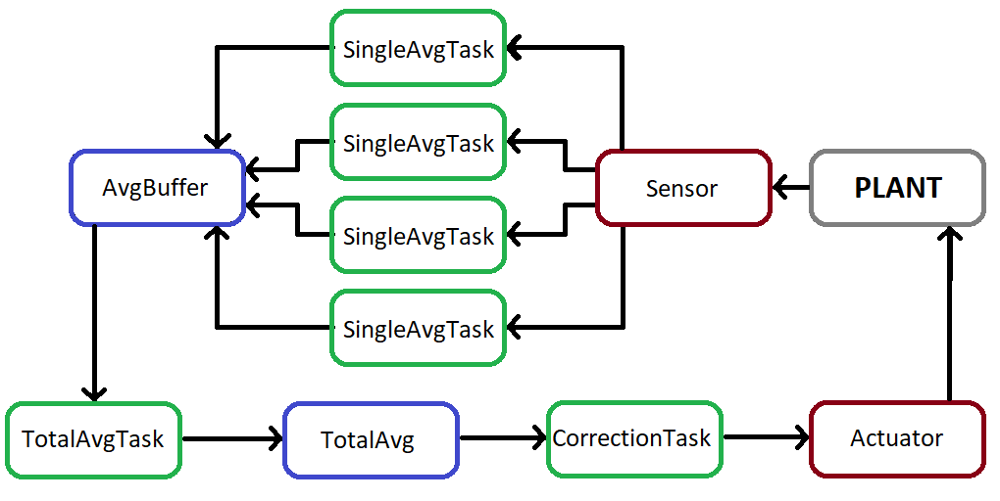

# RTOS_example

 The project aim was to deeply study how the real time system implemented in RTOS works, implement a simple application and a fault injection system. All the task are real time task with a defined deadline to respect and a given priority

 The idea of the application was to reproduce the speed management of a generic plant. The user can set the desired speed of the plant and a control system, via a sensor and an actuator, grants that it is reached. The plant speed is initially 0 and will always tend to reach this value again

 Four tasks periodically read the value from the register of the sensor. An error is simulated (between -0.25 and 0.25) when the sensor register is read, to reduce its relevance the value is read 100 times and then the average value is calculated. When the result is ready, the task coordinates with the other to stored it in a shared buffer.

 When all the four tasks are done, another task reads the values in the shared buffer and calculates an average mean and sends the result to the correction task. The correction task calcucates the correction that needs to be applied on the actual speed to reach the desired one. It writes in the register of the actuator a value mapped to a command: increase the speed, decrease it or do nothing.

 While the plant is running, the user can simulate a crash from the interface. It is implemented through a sudden variation of the speed and, if it is detected, an additional task with the highest priority activates the airbag

 In the image below it is is schematized how the plant normally works:

 

 The fault system is meant to cause five different effects:

* Masked error: the application keeps running without any problem
* Silent data corruption: the application keeps running but a value is modified
* Deelay: a task is deelayed cannot end within its deadline
* Hang: the application is stuck and cannot proceed
* Crash: the application crashes

The fault injection to cause the desired behavior is not randomic but switch specific bits in the system. The fault injection can be selected by the user through the interface.
